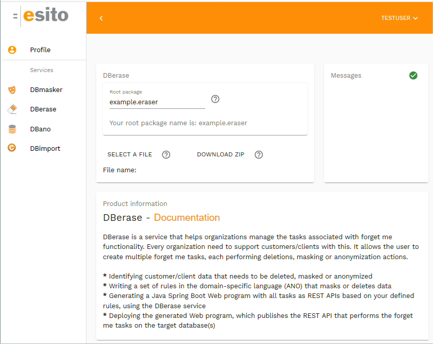

# DBerase

This project contains resources for [DBerase](http://www.esito.no/dberase) example project. It demonstrates GDPR forget me masking of customers in a hotel booking systems database. The example consists of the combination of this github project and use of the DBerase service. The generated program uses spring boot, runs in a webserver and has embedded REST APIs for the defined erase functions. 

## Prerequisites to run the program ##

The example uses Java, Maven and H2 database. It is tested with the versions:

- Java 1.8/1.13
- Maven 3.6.1
- H2 1.4.200

## Using the samples ##

Download and unzip this project to a java project (`dberase`) or clone the repository: 

	git clone https://github.com/esito/dberase.git

Files which are part of the project:

- `erasesample\eraseme.ano`: describes erase rules, input to the DBerase service
- `erasesample\application.properties`: database connection settings
- `erasesample\src\main\java`: source files which represents custom implementations
- `erasesample\src\main\resources`: schema for the H2 database
	- `data.sql`: schema and inserts to create the H2 database

### Create and populate the database ###

The database will be created and populated by the generated spring boot application.

### Investigate the ANO file ###

From the erasesample folder, look at the `eraseme.ano` file. It contains a program written in the **ANO** DSL language which consists of

- description of database structure
- two erase tasks and rules describing how to anonymize, mask and remove data

The syntax is described in [http://dbmasker.esito.no/help/topic/no.esito.g9.doc.dbservices/DBerase.html](http://dbmasker.esito.no/help/topic/no.esito.g9.doc.dbservices/DBerase.html). 

The simplified domain model for this sample project:

### Generate the GDPR forget me program code ###

Go to the [http://anonymizer.esito.no](https://anonymizer.esito.no) web, register a user and subscribe to the DBerase service.

Go to the DBerase service on [http://anonymizer.esito.no/auth/dashboard/dberase](https://anonymizer.esito.no/auth/dashboard/dberase). Choose **SELECT A FILE** and use the `eraseme.ano` file as the **Erase model File name** parameter to the service. Ignore the **Root package** parameter (giving `example.eraser` package value) and press the **DOWNLOAD ZIP** button.

The project `dberase-master/erasesample` will look like this before unzipping the result:

	src/main/java/example/eraser/transformations/PostCodeGeneralization.java
	src/main/resources/data.sql
	application.properties
	eraseme.ano

Unpack the resulting zip to the java project you downloaded/cloned from github. Unzip the generated source into the `erasesample` folder. The `pom.xml` and `readme.md` will be copied to the `erasesample` project root. Generated code is written to the `src` folder. It is regenerated each time the **DBerase** service is used. Be aware of that customizations might be overwritten each time it is regenerated. 

## Prepare and setup ##

### Using Maven, edit pom.xml ###

The generated source may be built using Maven. Add the H2 dependencies to the `pom.xml` file and change the version number to fit your H2 installation:

    <properties>
        <h2.version>1.4.200</h2.version>
    </properties>
    
    <dependency>
        <groupId>com.h2database</groupId>
        <artifactId>h2</artifactId>
        <version>${h2.version}</version>
    </dependency>

To build the eraseme sample program, open a command shell and run **mvn install**, which creates the `eraseme-0.0.1.jar` in the `target` folder.

### Edit application.properties ###

If necessary, edit the database and jpa properties in the `application.properties` file in the `src/main/resources` folder:

	# Database connection parameters
	spring.jpa.hibernate.ddl-auto=create-drop
	spring.datasource.url=jdbc:h2:mem:testdb
	spring.datasource.driverClassName=org.h2.Driver
	spring.datasource.username=sa
	spring.datasource.password=
	spring.jpa.database-platform=org.hibernate.dialect.H2Dialect
	spring.h2.console.enabled=true
	spring.h2.console.path=/h2-console
	spring.h2.console.settings.trace=false
	spring.h2.console.settings.web-allow-others=true

## Run the generated application ##

To test the generated code, start a command shell and run this command from the erasesample folder: **java -jar target/eraseme-0.0.1.jar**. It starts the Spring Boot program `example.eraser.Application`. The H2 database will be populated on start with data from data.sql.

The program name **eraseme** is given by your input `eraseme.ano` file name. The program displays the Spring Boot and eraseme program messages on startup.

To check that the database connection is ok: [http://localhost:8080/h2-console](http://localhost:8080/h2-console).

Test the generated REST API by navigating to [http://localhost:8080/swagger-ui.html](http://localhost:8080/swagger-ui.html) and open the `erase-controller`.

A set of tasks is defined as REST endpoints:

	Available erase tasks:
		/api/erase - general api that takes taskname and necessary parameters 
		/api/Erase_CUSTOMER - takes customerno as parameter
		/api/Erase_HOTELROOMCATEGORY - takes hotel_id, roomcategory_id and fromdate as parameters

Each of these tasks may be run with the swagger console.

Check how the erase tasks work:

- investigate the content of the H2 database
- check how the tasks and rules are defined in the `eraseme.ano` file
- run the tasks, one at the time
	- erase_customer 1000234 (the number is one of the customer ids)
	- erase_hotelroomcategory 1 11 2005-10-15
- check the database result

### Sample database session ###

Inspect the H2 database by navigating to [http://localhost:8080/h2-console](http://localhost:8080/h2-console):

	select * from customer where customerno=1000234;
	select * from hotelroomcategory where hotel_id=1 AND 
		ROOMCATEGORY_ID = 11 AND FROMDATE = '2005-10-15';